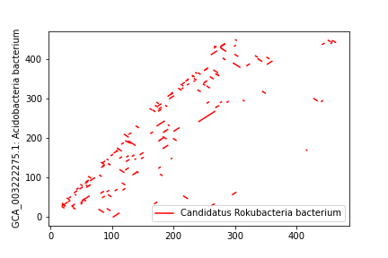
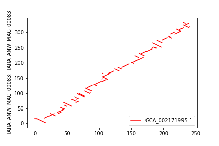
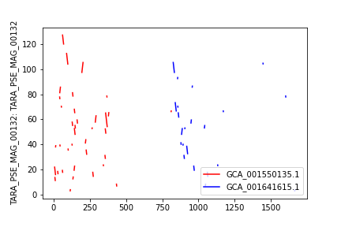
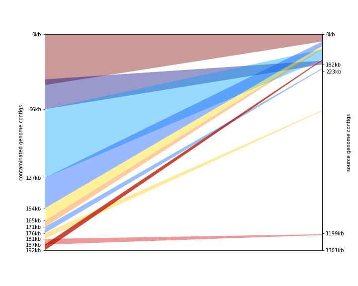
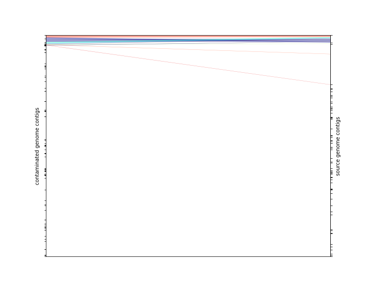

# Stacked dot plots

## an exploratory repository

Run [mashmap](https://github.com/marbl/MashMap) or
[nucmer](https://github.com/mummer4/mummer) to find alignments between
a query genome and one or more target genomes; plot in a few different
ways.

See [the source in `alignplot.py`](./alignplot.py) and
[the `examples` notebook](./examples.ipynb) for more info.

The first two examples below are of "non-stacked" dotplots, as in,
they are just pairwise dotplots.

The third example below "stacks" the dotplots on the x axis, so that you can
see two dotplots against the same query genome in the query genome
coordinates, but with the target genomes split out.

The fourth and fifth examples below are in a "sloped alignment"
reporting format that I used extensively in
[a 2005 paper](https://bmcbioinformatics.biomedcentral.com/articles/10.1186/1471-2105-6-70), and resurrected here in matplotlib-land.

## installation and running

For now, if you want to try this out for yourself --

* you'll need python3 installed
* you'll need mummer4 and/or mashmap installed, along with matplotlib and numpy.
* you'll need to put genomes somewhere (e.g. the `genomes/` directory)
* you can add names or replace names in info.csv
* see [the source in `alignplot.py`](./alignplot.py) and
[the `examples` notebook](./examples.ipynb) for more info on actually running.

(More work to be done here -- will binderize eventually :)

## examples

### A gallery

Please see
[the rendered examples](https://ctb.github.io/2020-stacked-dot-plots/examples.html)
for a gallery of comparisons along with some basic code. Some example figures
are below.

### Shared sequences (contamination?) between two Genbank genomes.

Here, the Rokubacterium (red, x axis) is probably contaminated by sequences
from the Acidobacterium (y axis coordinates).

### Shared sequences between a TARA MAG and a Genbank genome.

The TARA binned genome/MAG is on the y axis, the Genbank genome is on x in
red.

### Shared sequences between a TARA MAG and two Genbank genomes.

The TARA binned genome/MAG is on the y axis, the first Genbank genome
is on x in red, the second is on x in blue.

### A small set of shared sequences between two genbank genomes

Comparing `GCF_001683825.1`, a Flavobacterium, with `GCF_000181835.1`,
a strain of *Bacillus anthracis*.

## contact

Titus Brown, titus@idyll.org

All code here is Copyright: 2020, The Regents of the University of
California. It is freely available for use and reuse under the BSD
3-Clause license; please see the `LICENSE` file for more info.

CTB Nov 2020
